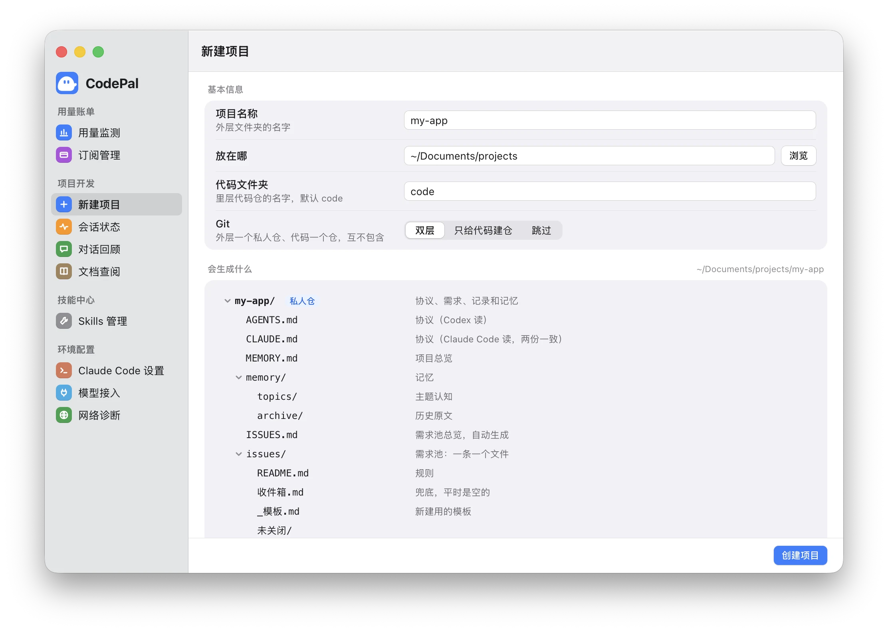

# CodePal — AI 编程的幕后助手

> AI 编程工具负责写代码，CodePal 负责写代码之外的一切 —— 用量与订阅、会话状态、对话回顾、Skills 管理、用别家模型开 Claude Code。专为 **Claude Code / Codex** 用户打造。

[](https://github.com/yunshu0909/CodePal/releases) [](https://github.com/yunshu0909/CodePal/releases/latest) [](#license)

<p align="center">
  
</p>

<p align="center"><sub>本页截图全部来自作者日常使用的真实界面和真实数据（出口 IP、用户目录已打码）</sub></p>

---

## 为什么需要 CodePal？

用 AI 写代码是起点，写代码之外的"管理"才是日常摩擦：

- 想知道这个月 **Token 用了多少**、订阅到底值不值
- AI 在终端里跑完了、卡在等你确认，切走就不知道
- 找不到上次和 AI 聊过的某条历史对话，翻不到 Session 目录
- 几十个 **Skills** 装在 Claude Code 和 Codex 里，哪个开着、哪个没用过、哪个装了两份，说不清
- 想用 DeepSeek、Kimi 这类模型跑一下 Claude Code，又不想动自己的 Claude 配置

**没有一个 AI 工具会帮你做跨工具的事** —— Claude Code 不管 Codex，Codex 也不管 Claude Code。CodePal 做的就是它们之间的**连接层**，让 AI 工具各自专注写代码，其他的交给 CodePal。

所有数据都在本机读取，不上传任何服务器。

---

## 功能一览

CodePal 按用途分 4 组：**用量账单 · 项目开发 · 技能中心 · 环境配置**。每项都是独立模块，按需使用。

### 💰 用量账单

#### 用量监测 · 按月历看每天用了多少

- 自然月月历，每天一格，圆环显示当天完成目标的比例；点开某天看模型构成（见上方头图）
- 合并 Claude Code、Codex、DeepSeek Harness 三个来源的 Token 用量，CodePal 在后台调用别家模型的用量也算进来
- 可设每日目标，按「未达成 / 达成 / 优秀」三档着色
- 某天统计失败会明确标出、可以单独重试，不会悄悄算成 0

#### 订阅管理 · 订阅值不值

<p align="center"></p>

- Claude Code、Codex 各一张卡：本订阅周期按 API 价折算的等价费用、订阅费、**值回几倍**、省了多少、还剩几天
- 按模型拆开看钱花在哪；设置价格、账单日、自动续费，可往回翻看历史周期
- 按当时的模型价格计算，价格表随仓库更新，不用升级应用

---

### 🧑‍💻 项目开发

#### 会话状态 · 终端里的 AI 干完活会通知你

<p align="center"></p>

<p align="center"></p>

- 实时列出 Claude Code、Codex 的会话：进行中 / 等你确认 / 完成了 / 已停止
- 完成或需要你处理时发 macOS 系统通知，点通知回到 CodePal
- 自动为两个工具装好所需的钩子，关掉开关即删除；Codex 的钩子会自动加入信任名单

#### 对话回顾 · 找得到也接得上

<p align="center"></p>

<p align="center"></p>

- 跨项目按时间倒序浏览 Claude Code 历史对话，按项目筛选、全文搜索
- 点进去看完整对话；一键复制 `claude --resume` 参数，或直接在新终端接着聊
- 用别家模型开的会话会标出模型名；CodePal 在后台自动调用产生的会话默认隐藏，勾选「自动调用」可见

#### 文档查阅 · 像访达一样翻 Markdown

<p align="center"></p>

- 添加多个文件夹作为根目录，左栏是访达边栏式的目录树，按文件名搜索
- 右栏按阅读排版渲染 Markdown：标题分层、表格数字不断行，开头的元数据和注释不显示
- 截图里打开的是「新建项目」生成的示例项目

#### 新建项目 · 一键生成 AI 可接管的项目骨架

<p align="center"></p>

从一个空目录生成照 CodePal 自己的工作区搭好的项目，建完用编辑器打开就能让 AI 接手：

- 外层放协议、需求、规格、记忆和文档（私人），代码在里层单独一个文件夹（名字可改，默认 `code`）
- 同构的 `AGENTS.md` / `CLAUDE.md` 协议 v4，分别供 Codex / Claude Code 读取；项目特有的部分第一次对话时由 AI 引导补全
- `MEMORY.md` + `memory/`（主题、会话交接、历史）
- `ISSUES.md` 总览 + `issues/` 一条一个文件，配 `docs/issue-check.py` 小工具；`specs/` 按版本归档工作单元
- Git 三种方式：双层（默认，外层私人仓 + 代码仓）、只给代码建仓、跳过；建好的仓各做一次初始提交（分支 `main`）
- 带上 dev-workflow 要的私人路径清单，装了插件开箱即用，没装也能照协议手工走

先看生成后的完整目录、教学案例与 skill 来源：[CodePal Managed Project Example](https://github.com/yunshu0909/codepal-managed-project-example)。配套 skills 的公开源码在 [云舒的 Skills Hub](https://github.com/yunshu0909/yunshu_skillshub)。

---

### 🛠 技能中心

#### Skills 管理 · 两个工具各自装了什么，一目了然

<p align="center"></p>

<p align="center"></p>

- **装载总览**：Claude Code、Codex 各装了几个 Skill、约占多少上下文 tokens，按来源拆开（自己开的 / claude.ai 同步 / Codex 自带）
- 左栏按使用分组：近 30 天在用（按次数排）、外部、近 30 天没用，一眼看出哪些可以关
- 详情里每个工具一个开关，点了就生效，写完按工具自己的读法核对，**要么生效、要么失败并保留原状态**；Codex 开关走 Codex 官方接口
- 「要处理」提醒：外部 Skill 没收进资产库、同一个工具里装了两份
- 中央资产库统一存放 Skill，删除时资产库和各工具里的一起删

---

### ⚙️ 环境配置

#### Claude Code 设置

<p align="center"></p>

- 默认权限模式，6 档：全自动 / 自动审批 / 自动编辑 / 每次询问 / 仅预先授权 / 只读规划，下次启动生效
- 底部状态栏：看接入状态、开关显示，带终端效果预览
- CodePal 是 `~/.claude/settings.json` 的唯一写入口，内容没变就不重写

#### 模型接入 · 用别家模型开 Claude Code（macOS）

<p align="center"></p>

- 支持 DeepSeek、MiMo API、智谱 API、Kimi API、智谱 Coding Plan、Kimi Coding Plan，每家单独填 Key
- 点「测一下」就知道能不能用；失败时说清是 Key 无效、余额不足、模型名不对还是连不上
- 可以加模型、改模型名，调思考强度和上下文 / 输出上限
- 每个模型一条终端命令（如 `codepal-deepseek-flash`），敲它就是用这个模型开 Claude Code；CodePal 关着也能用，**不改你的 Claude 配置**，和会员版 Claude Code 可以同时开着
- AI 在后台调用别家模型也走同一条命令（比如让另一个模型给代码做交叉审核）

#### 网络诊断 · 出口 IP 变了第一时间知道

<p align="center"></p>

- 查看当前出口 IP 和所在地（截图中已打码）
- 可开持续监控：IP 变化或连续测不到时发系统通知，挂 VPN 时排查用；保留近 7 天的 IP 变化记录

---

## 快速开始

### 🚀 下载使用（推荐）

从 [Releases](https://github.com/yunshu0909/CodePal/releases/latest) 下载最新安装包：

- **macOS Apple Silicon (M 系列)** — `.dmg`，主力支持
- **Windows (x64)** — 随版本自动构建安装包，作者日常不在 Windows 上使用，可能有未发现的问题；「模型接入」只在 macOS 上提供
- Intel macOS — 暂未打包，如需请自行本地构建

应用内会检查新版本并提示更新。

### 🧑‍💻 本地开发

```bash
git clone https://github.com/yunshu0909/CodePal.git
cd CodePal
npm install
npm run dev
```

`npm run dev` 会同时启动 Vite 开发服务器和 Electron 主进程，支持热重载。

### 📦 自行打包

```bash
npm run dist:mac    # macOS (arm64) .dmg
npm run dist:win    # Windows (x64) NSIS 安装包
```

产物在 `release/` 目录。

---

## 环境要求

- **macOS**（Apple Silicon 优先，Intel 能跑但未打包发布）
- **Node.js 24+**（与 Electron 40 内置的 Node 一致；DSH 用量解析依赖 Node 自带的 zstd）
- **npm 9+**

---

## 技术栈

| 技术 | 版本 | 用途 |
|---|---|---|
| Electron | ^40.2.1 | 桌面容器 |
| React | ^19.2.4 | 渲染层 |
| Vite | ^7.3.1 | 前端构建 |
| Vitest | ^4.0.18 | 单元测试 |
| react-markdown | ^10.1.0 | 对话回顾、文档查阅的 Markdown 渲染 |
| chokidar | ^4.0.3 | 文件监听（Skills 中央仓库） |
| smol-toml | 1.9.0 | 按 TOML 语义读写 Codex 配置 |

---

## 项目结构

```
CodePal/
├── electron/                  # 主进程（Node.js 环境）
│   ├── main.js                # 入口：窗口 + 注册
│   ├── preload.js             # contextBridge 暴露 electronAPI
│   ├── handlers/ · ipc/       # 按领域拆分的 IPC handlers
│   ├── modules/               # 按领域竖切的新模块（ipc + service，如模型接入）
│   ├── platform/              # 跨领域底座
│   └── services/              # 可复用业务服务（可测试）
├── src/                       # 渲染进程（React）
│   ├── App.jsx                # 根组件 + 模块路由
│   ├── pages/ · features/     # 各功能页面
│   ├── components/            # 通用组件库
│   ├── hooks/                 # 自定义 hook
│   ├── store/                 # 数据层
│   └── styles/                # 设计 tokens 与 macOS 原生风格共用样式
├── tests/                     # 自动化测试（Vitest）
├── shared/                    # 主进程与界面共用的纯函数（如新建项目会生成什么）
├── templates/                 # 新建项目模板、会话状态钩子脚本
├── docs/images/               # README 截图
└── package.json               # build 配置、scripts、依赖
```

提交前跑 `npm run lint && npm test`，CI 也会跑同样的检查。

---

## 版本历史 & Release

完整版本信息见 [GitHub Releases](https://github.com/yunshu0909/CodePal/releases)。

**最新版本：[v2.1.7](https://github.com/yunshu0909/CodePal/releases/tag/v2.1.7)**

- 🗂 新建项目换成 macOS 原生风格：一张表单填项目名称、放在哪、代码文件夹、Git 方式，下面实时看会生成什么，不再一项项勾选
- 🧱 生成的项目照 CodePal 自己的工作区：协议 v4、记忆、一条一个文件的需求池、specs、docs 与两个检查小工具，代码单独一个仓；建好的仓各做一次初始提交（分支 `main`）
- 🔧 修复：创建时找不到 Git 会直接说「没找到 Git」，不再显示英文报错

**v2.1.4**

- 🔧 修复：会话状态和对话回顾不再把系统注入的消息当成你的任务显示
- 🛠 Skills 管理切回来时先显示上次的结果，后台刷新完再更新，不再整页空白等待

**v2.1.3**

- 🛠 Skills 管理换成 macOS 原生风格双栏：装载总览看两个工具各装了多少、占多少上下文；左栏按近 30 天用没用分组；详情里每个工具一个开关
- 🔧 修复：Codex 的 Skill 开关以前写进配置但 Codex 不认，现在改走 Codex 官方接口，写完核对，要么生效要么失败；以前关了没生效的会自动补关（先备份配置）
- 🧹 插件页下线：插件的安装和开关交还各工具自己的命令行
- 📄 文档查阅：子目录在根目录下正确缩进

**v2.1.2**

- 📄 文档查阅换成 macOS 原生风格：左栏像访达边栏的目录树，正文排版更好读（标题分层、表格数字不再断行、开头元数据和注释不再显示）
- 🔌 模型接入新增 MiMo、智谱、Kimi 的 API 与 Coding Plan 渠道，每家单独填 Key、测一下、开终端
- 📊 用量监测与对话回顾把 CodePal 在后台调用别家模型的记录也算进来（对话回顾里默认隐藏，勾选「自动调用」可见）
- 🔧 修复：打开 CodePal 时不再重写内容没变的 `~/.claude/settings.json`，也不再多存备份

**v2.1.1**

- 🔧 修复：安装版里打开「会话状态」报「未找到内置会话状态模板」（v2.0.0 起就有）

**v2.1.0**

- 🔌 新增「模型接入」（macOS）：填 DeepSeek 的 Key 就能用它开 Claude Code；一键装终端命令 `codepal-deepseek-flash`，CodePal 关着也能用，不改你的 Claude 配置
- 🧪 「测一下」直接告诉你能不能用；失败时说清是 Key 无效、余额不足、模型名不对还是连不上
- 🤖 AI 在后台调用别家模型也走同一个命令，结果回到页面上
- 💬 对话回顾：用别家模型开的会话，详情里标出模型名

之前的里程碑版本：
- **v2.0.0** — 界面换成 macOS 原生风格；会话状态与订阅管理；配置写入更安全
- **v1.9.11** — 修正 Codex 额度窗口口径
- **v1.9.10** — 网络诊断默认零公网请求；新建项目使用托管 Coding 协议 v3.1
- **v1.5.2** — 稳定版发布 + 配置打包兜底 + 对话回顾恢复链路
- **v1.4.5** — 对话回顾支持「启动历史对话」（复制 resume / 新终端启动）
- **v1.2.6** — 对话回顾页上线

---

## 贡献

CodePal 目前是作者自用驱动的产品，**不提前规划功能列表**，遵循"用 → 痛 → 解决 → 沉淀"的飞轮。如果你有痛点，欢迎提 Issue；如果想贡献代码，建议先开 Issue 讨论。

---

## License

ISC — by [云舒](https://github.com/yunshu0909)
