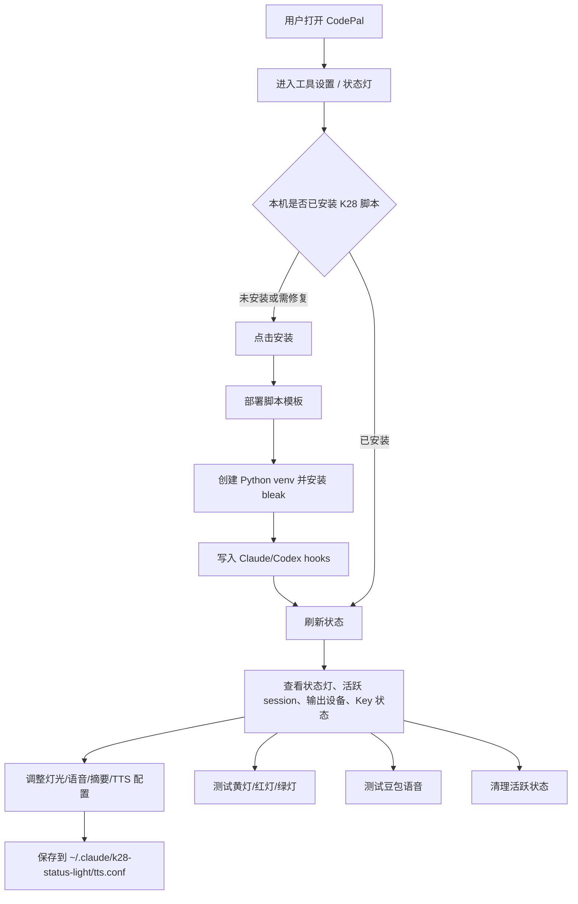

# 产品需求文档：CodePal V1.7.2（K28 状态灯控制台）

> 文档版本：v1.7.2-k28-r1  
> 创建日期：2026-05-31  
> 对应版本：`v1.7.2`  
> 版本类型：`feature / 本机硬件集成`  
> 当前状态：`已实现事实校准`  
> 对应模块：`src/pages/K28StatusLightPage.jsx`、`electron/services/k28StatusLightService.js`、`electron/handlers/registerK28StatusLightHandlers.js`、`electron/preload.js`、`electron/main.js`、`templates/k28-status-light/`

---

## 0. v1.7.2 页面重设计变更说明（2026-05-31）

本 PRD 初版按「已实现事实校准」撰写。2026-05-31 对页面做了一次**只改 UI / 交互、不改后端功能**的重设计（设计产物见 `docs/design/v1.7.2-k28-status-light/`，方案 A）。以下条目据此修订，阅读下文 US / AC 时**以本节为准**：

| 原条目 | 变更 | 现状 |
|---|---|---|
| US-03 / AC-10 | 豆包高级参数（音色、资源 ID、语速、超时、输出设备、DeepSeek Base URL / 模型）**移出 UI、代码写死** | 页面仅保留三个开关 + 两个 API Key + 链路自检。后端 `normalizeNumberString` 范围钳制仍在，AC-10 降级为**后端契约级验收**，不在 UI 验收 |
| US-02 / AC-05、AC-06 | 保存模型改为**开关拨动即时保存（乐观更新 + 失败回滚）+ API Key 行内各自保存**，删除全局保存栏 | AC-05 / 06「开关与 conf 一致、刷新后保持」仍成立，触发方式由「点保存」变为「拨动即写」 |
| US-06 / AC-21 | **「打开目录」按钮已移除** | `openK28Directory` 的 IPC / service 通道暂留但 UI 无入口（未清理）。AC-21「打开目录失败 Toast」在当前 UI 下不可触达，**标记为失效** |
| AC-08 | 空 Key 保留旧值 | UI 层 `ApiKeyField` 进一步用「空值禁用保存 + 取消退出」前端拦截；后端「空字符串=保留旧值」契约不变，二者一致 |

其余 US-01 / US-04 / US-05 与全部安全要求（IPC 脱敏、空 Key 保留旧值、hooks 备份与幂等）**未变更**。

---

## 1. 背景与问题定义

用户已有一套全局 K28 状态灯脚本，位于：

```text
~/.claude/k28-status-light
```

这套脚本负责把 Claude / Codex 的工作状态映射到 ERAZER K28 / K28LED 像素蓝牙音响屏幕，并在需要时调用豆包 TTS 播报任务摘要。

原始形态存在几个使用问题：

- 开关、音色、输出设备、超时和 API Key 都需要手动编辑 `tts.conf`。
- 新电脑需要手动复制脚本、创建 Python venv、安装 `bleak`、配置 Claude/Codex hooks。
- TTS 失败时曾可能听到 macOS 原声回退，用户希望失败时直接静默跳过。
- 用户需要一个 CodePal 内的可视化组件，统一控制开启/关闭、语音、测试和换机安装。

本需求将 K28 状态灯沉淀为 CodePal 的「状态灯」工具设置页面，并把底层脚本模板打包进应用，实现新电脑一键安装/修复。

---

## 2. 用户故事地图



---

## 3. 本版目标

### 目标 1：CodePal 内集中控制 K28 状态灯

用户可以在 CodePal 中查看 K28 状态灯安装状态、活跃 session、当前输出设备、豆包 Key 和 DeepSeek Key 是否已配置，并通过表单控制状态灯、语音和任务摘要行为。

### 目标 2：提供一键安装/修复能力

新电脑打开 CodePal 后，用户点击「安装」即可完成基础部署：

- 复制内置 K28 脚本模板到 `~/.claude/k28-status-light`
- 创建 Python venv
- 安装 `bleak`
- 写入 Claude hooks
- 写入 Codex hooks，并确保 Codex `features.hooks = true`

### 目标 3：保护本机敏感配置

API Key 只保存在本机 `tts.conf`。渲染层只知道 Key 是否存在，不拿到真实 Key。保存配置时，Key 输入框留空表示保留旧值，不覆盖为删除。

### 目标 4：减少异常噪音

TTS 失败时不回退 macOS 原声。页面内不展示 TTS 日志模块，避免把调试信息暴露成常驻用户界面。

### 目标 5：符合 CodePal 现有 UI 和 Electron IPC 边界

页面复用 `PageShell`、`Button`、`Toggle`、`Tag`、`StateView`、`Toast` 等现有组件；本机文件和命令操作只在 Electron 主进程服务中执行。

---

## 4. 非目标

以下内容不属于本版：

- 不重新实现 K28 BLE 协议或 PixelChange 的底层协议研究。
- 不在 CodePal 中管理多个蓝牙设备的扫描、配对和选择流程。
- 不把真实 API Key 打包到应用模板或提交到仓库。
- 不支持 Windows 的 K28 状态灯安装流程。
- 不在 UI 中保留 TTS 日志面板；需要排查时仍可从本机日志文件读取。
- 不保证新电脑完全零配置可用；API Key、输出设备、蓝牙地址仍属于本机配置。

---

## 5. 详细需求

### US-01：查看 K28 状态灯运行状态

作为 CodePal 用户，我希望在一个页面看到 K28 状态灯是否已安装、是否运行、当前输出设备和 Key 配置状态，从而判断功能是否可用。

业务规则：

1. 页面入口位于左侧导航「工具设置 / 状态灯」。
2. 页面标题为 `K28 状态灯`，副标题说明其控制 AI 工作状态灯、豆包语音和本地运行状态。
3. 后端状态来源为 `~/.claude/k28-status-light`。
4. 安装状态必须检查关键文件，而不是只检查目录存在。
5. 页面展示活跃 session 数量、当前输出设备、豆包 Key 是否配置、DeepSeek Key 是否配置。
6. 页面展示活跃状态列表，包含项目名、状态、时间和任务摘要。

验收标准：

- AC-01：已安装且状态灯开启时，状态标签显示 `运行中`。
- AC-02：未安装或关键脚本缺失时，状态标签显示 `未安装`。
- AC-03：状态灯关闭时，状态标签显示 `已关闭`。
- AC-04：Key 字段只显示 `已配置` / `未配置`，不得显示真实 Key。

### US-02：控制灯光、语音和任务摘要开关

作为用户，我希望不用编辑配置文件，就能开启或关闭状态灯、语音和任务摘要。

业务规则：

1. `STATUS_LIGHT_ENABLED=0` 时，Claude/Codex hook 进入后直接跳过，不写状态、不渲染屏幕。
2. `VOICE_ENABLED=0` 时，只保留屏幕状态，不提交豆包 TTS 播报任务。
3. `TASK_SUMMARY_ENABLED=0` 时，不调用 DeepSeek 摘要能力。
4. 保存配置写入 `~/.claude/k28-status-light/tts.conf`。
5. 保存前应备份已有 `tts.conf` 到 `~/.claude/k28-status-light/backups/`。

验收标准：

- AC-05：三个开关的 UI 状态与 `tts.conf` 中的 `0/1` 值一致。
- AC-06：保存后再次刷新页面，开关状态保持一致。
- AC-07：关闭语音后，测试语音按钮不可用或不触发有效播报。

### US-03：配置豆包 TTS 和 DeepSeek 摘要参数

作为用户，我希望在 CodePal 中配置豆包音色、资源 ID、语速、输出设备、超时秒数、豆包 API Key 和 DeepSeek API Key。

业务规则：

1. 豆包音色字段对应 `VOLC_SPEAKER`。
2. 资源 ID 字段对应 `VOLC_RESOURCE_ID`。
3. 语速字段对应 `VOLC_SPEED`，范围限制为 `0.5` 到 `2`。
4. 超时秒数字段对应 `TTS_TIMEOUT_SECONDS`，范围限制为 `3` 到 `60`。
5. 输出设备字段对应 `OUTPUT_DEVICE`。
6. DeepSeek Base URL 和模型继续保留在配置模型中，当前页面保留必要参数写入能力。
7. API Key 输入框留空表示保留旧值，只有非空输入才覆盖。

验收标准：

- AC-08：保存空 API Key 不会清空旧 Key。
- AC-09：后端返回给前端的数据不包含 `VOLC_API_KEY` 或 `DEEPSEEK_API_KEY` 明文。
- AC-10：非法数字输入会被后端规范化到允许范围内。

### US-04：测试灯色和语音链路

作为用户，我希望可以直接测试黄灯、红灯、绿灯和豆包语音，确认蓝牙链路和 TTS 配置正常。

业务规则：

1. 灯色测试通过 `~/.claude/k28-status-light/.venv/bin/python k28_set.py <state>` 执行。
2. 支持 `busy`、`attention`、`done` 三类测试按钮。
3. 语音测试通过 `tts_say.py` 执行固定测试文案。
4. 命令失败时通过 Toast 告知用户，不让页面崩溃。

验收标准：

- AC-11：点击黄灯、红灯、绿灯测试后，对应按钮显示 loading，并在完成后恢复。
- AC-12：命令成功时显示成功 Toast。
- AC-13：命令失败时显示错误 Toast。

### US-05：一键安装/修复 K28 状态灯

作为换机用户，我希望 CodePal 能一次性完成 K28 状态灯基础安装，避免手动复制和配置 hooks。

业务规则：

1. 页面顶部提供「安装」按钮。
2. 安装从 `templates/k28-status-light/` 复制脚本到 `~/.claude/k28-status-light`。
3. 安装时不得覆盖已有 `tts.conf`，避免覆盖真实 Key。
4. 脚本文件复制后必须设置可执行权限。
5. 如果 `.venv/bin/python` 不存在，执行 `python3 -m venv ~/.claude/k28-status-light/.venv`。
6. 安装流程必须执行 `python -m pip install --quiet bleak`。
7. Claude hooks 写入 `~/.claude/settings.json`，写入前保留非 K28 hooks，并移除旧 K28 hook 后重建。
8. Codex hooks 写入 `~/.codex/config.toml`，确保 `[features] hooks = true`，并避免重复追加 K28 hooks。
9. 修改 Claude/Codex 配置前必须备份原文件。
10. 安装完成后自动刷新状态。

验收标准：

- AC-14：新电脑点击「安装」后，目录 `~/.claude/k28-status-light` 被创建。
- AC-15：内置脚本被复制，且 shell/python 脚本具备可执行权限。
- AC-16：已有 `tts.conf` 不被覆盖。
- AC-17：Claude/Codex 原有非 K28 hooks 不被删除。
- AC-18：重复点击「安装」不会重复堆叠 K28 hooks。
- AC-19：如果当前 Electron 窗口尚未加载 `installK28StatusLight` preload API，页面提示用户完全退出并重启 CodePal，而不是显示 JS 原始错误。

### US-06：清理活跃状态和打开目录

作为用户，我希望能一键清理活跃 session 状态，并快速打开 K28 工具目录排查配置。

业务规则：

1. 「清理」删除 `states/` 下的 `.txt` 和 `.task` 状态文件。
2. 若 `k28_render.py` 存在，清理后触发一次待机图案渲染。
3. 「打开目录」调用 Electron `shell.openPath` 打开 `~/.claude/k28-status-light`。

验收标准：

- AC-20：清理后活跃 session 列表为空或明显减少。
- AC-21：打开目录失败时给出 Toast 错误提示。

---

## 6. 安全与隐私要求

1. 真实 API Key 不得进入仓库模板。
2. `templates/k28-status-light/tts.conf` 中的 `VOLC_API_KEY` 和 `DEEPSEEK_API_KEY` 必须为空。
3. Electron IPC 返回给渲染层的配置必须脱敏，只返回 `hasVolcApiKey` 和 `hasDeepSeekApiKey`。
4. 保存配置时空 Key 必须解释为“保留旧值”，不能解释为“清空 Key”。
5. 修改 `~/.claude/settings.json` 和 `~/.codex/config.toml` 前必须备份。
6. 安装流程不得删除用户已有非 K28 hooks。

---

## 7. 兼容性与换机边界

本功能当前按 macOS 本机环境设计，依赖：

- `python3`
- Python venv
- `bleak`
- 可访问 pip 安装源
- Claude 配置目录 `~/.claude`
- Codex 配置目录 `~/.codex`
- 可用的 K28 蓝牙连接配置
- 可选的 `SwitchAudioSource` 用于读取当前输出设备

换机后的预期流程：

1. 安装并打开 CodePal。
2. 进入「工具设置 / 状态灯」。
3. 点击「安装」。
4. 在页面补齐豆包 API Key、DeepSeek API Key、输出设备和本机蓝牙地址相关配置。
5. 保存配置。
6. 重启 Claude/Codex，使 hooks 配置生效。
7. 使用灯色测试和语音测试确认链路。

已知边界：

- 如果新电脑无法访问 pip，`bleak` 安装会失败。
- 如果 Codex 对 hook 有额外信任确认，首次运行时可能仍需要用户在 Codex 侧确认。
- 如果 K28 蓝牙地址变化，仍需要按本机环境更新底层配置。

---

## 8. 实现映射

| 需求 | 实现文件 | 说明 |
|------|----------|------|
| 页面入口 | `src/App.jsx`、`src/components/WorkbenchLayout.jsx` | 增加 `k28-status-light` 模块和左侧导航项 |
| 控制页面 | `src/pages/K28StatusLightPage.jsx` | 状态展示、配置表单、安装、测试、清理、打开目录 |
| 页面样式 | `src/styles/k28-status-light.css` | 复用 CodePal Cool Steel 风格 |
| IPC 暴露 | `electron/preload.js` | 暴露 `getK28StatusLightState`、`installK28StatusLight` 等方法 |
| IPC handler | `electron/handlers/registerK28StatusLightHandlers.js` | 注册 K28 channel |
| 主进程服务 | `electron/services/k28StatusLightService.js` | 文件读写、脱敏、安装、hook 配置、测试命令 |
| 安装模板 | `templates/k28-status-light/` | 打包 K28 脚本和空 Key 配置模板 |
| 打包配置 | `package.json` | `build.files` 包含 `templates/**/*` |

---

## 9. 测试账本

| 编号 | 类型 | 覆盖点 | 当前证据 |
|------|------|--------|----------|
| T-01 | 静态检查 | K28 service / handler / preload / main 语法合法 | 已执行 `node -c`，通过 |
| T-02 | 构建 | Vite 生产构建 | 已执行 `npm run build`，通过；仅有 chunk size warning |
| T-03 | Electron 渲染 | 状态灯页面可打开，无控制台错误 | 已用 Playwright Electron 验证通过 |
| T-04 | UI 回归 | 「安装」按钮可见 | 已验证 `installVisible=true` |
| T-05 | UI 回归 | TTS 日志面板已移除 | 已验证 `hasLogPanel=0` |
| T-06 | 文案 | 换机说明展示一键安装边界 | 已验证页面 note 文案存在 |
| T-07 | 安全 | IPC 不返回真实豆包/DeepSeek Key | 已用脱敏检查确认 |
| T-08 | 错误体验 | preload 未刷新时提示重启 CodePal | 已在页面安装 handler 中增加接口存在性检查 |

需要后续补齐的自动化：

- K28 service 单元测试：`installTemplateFiles` 不覆盖已有 `tts.conf`。
- K28 service 单元测试：`installClaudeHooks` 保留非 K28 hooks。
- K28 service 单元测试：`installCodexHooks` 重复执行不重复追加 hooks。
- K28 service 单元测试：空 Key 保存保留旧 Key。
- E2E 测试：从导航进入状态灯页面并执行刷新。

---

## 10. 发布门禁

本功能进入可发布状态前至少需要满足：

1. `npm run build` 通过。
2. Electron 页面 smoke 通过：状态灯页面可打开、安装按钮可见、无 console error。
3. 模板目录不包含真实 API Key。
4. 新电脑安装流程在一台无 `~/.claude/k28-status-light` 的 macOS 机器上人工验证通过。
5. 真实 K28 设备上完成灯色测试和语音测试。

当前证据等级：

- 代码构建：`Artifact verified`
- 页面 smoke：`Artifact verified`
- Key 脱敏：`Artifact verified`
- 新电脑完整安装：`Pending real-machine verification`
- 真实 K28 设备链路：`Pending device verification`

---

## 11. 风险与后续事项

### 风险

- 安装流程会修改用户的 Claude/Codex 配置文件，虽然有备份，但仍属于高影响本机操作。
- `pip install bleak` 依赖网络环境，离线或镜像不可用时会失败。
- Codex hooks 的信任策略可能随版本变化，当前只能写入配置，不能替用户完成所有交互确认。
- K28 蓝牙环境和 macOS 音频输出设备存在本机差异，需要用户补齐。

### 后续建议

- 为 `k28StatusLightService` 增加独立单元测试。
- 页面展示安装步骤结果，帮助定位安装失败发生在哪一步。
- 后续如需要多人分发，可增加“导出脱敏配置诊断包”。
- 真实设备验证后，把结果补入本 PRD 的发布门禁证据。

